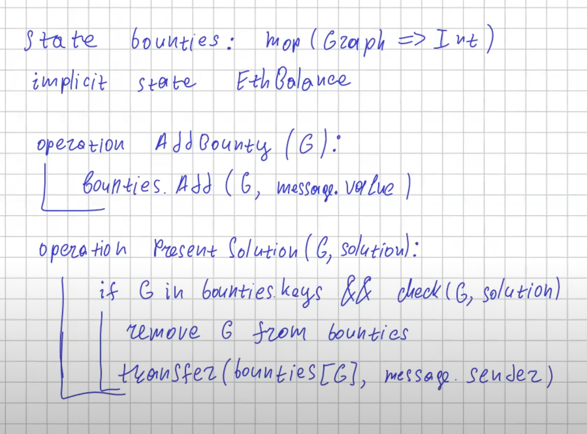

# Solidity Bounty

Реализация псевдокода смарт контракта с лекции на solidity.

## Описание

Можно в смарт контракте добавить сложную для решения и легкую для проверки задачу (к примеру нахождение гамильтонова цикла в графе) с вознаграждением. Кто-то может решить задачу и смарт контракт после проверки если задача решена верно выдает ему приз.

## Псевдокод



## Запуск тестов
```shell
npm install -g truffle
truffle test
```

## Деплой смарт контракта
```shell
truffle migrate
```

## Запуск приложения
```shell
cd app
npm i
npm start
```